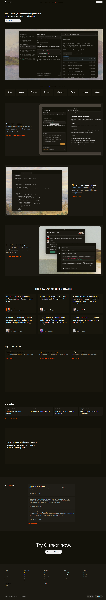

# Cursor Landing Page Clone

A responsive landing page recreation of **Cursor** built using pure **HTML5 and CSS3**.

This project focuses on clean layout structure, reusable CSS variables, and modern design techniques.

---

## > Sections Recreated

* Sticky Header / Navigation
* Hero Section
* Trusted By 
* Feature Sections 
* Testimonials Grid
* Use Cases
* Changelog
* Research Section
* Highlights
* Final CTA
* Footer 

---

## > Fonts Used

* `CursorGothic`
* System UI fallback stack:
  `-apple-system, BlinkMacSystemFont, "Segoe UI", Roboto, sans-serif`

---

## > Color Palette

* **Main Background:** `#13120A`
* **Card Background:** `#18160D`
* **Section Background:** `#1B1912`
* **Primary Text:** `#FFFFFF`
* **Muted Text:** `#A3A3A3`
* **Accent Orange:** `#F54E00`
* **Button Background:** `#EDECEC`

---

## 🚀 Run Locally

1. Clone the repository
2. Open `index.html` in your browser

---

## 📸 Screenshots

